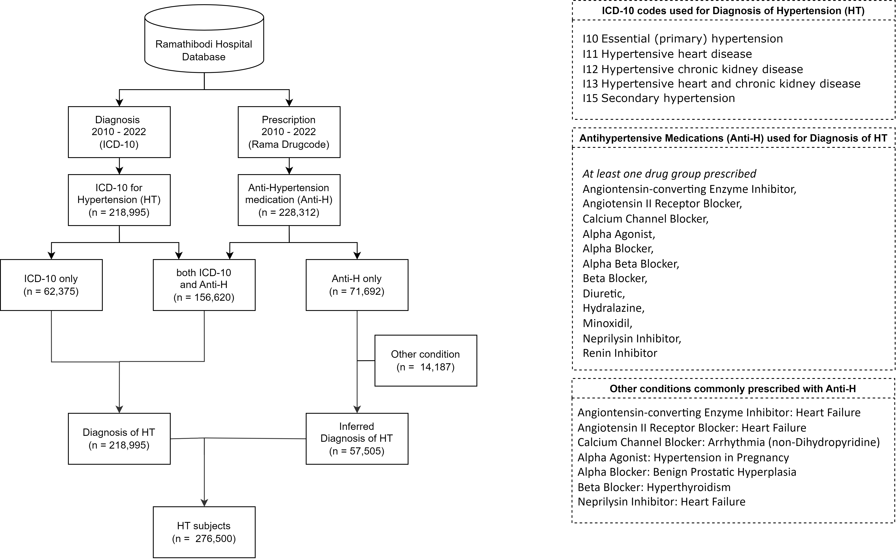
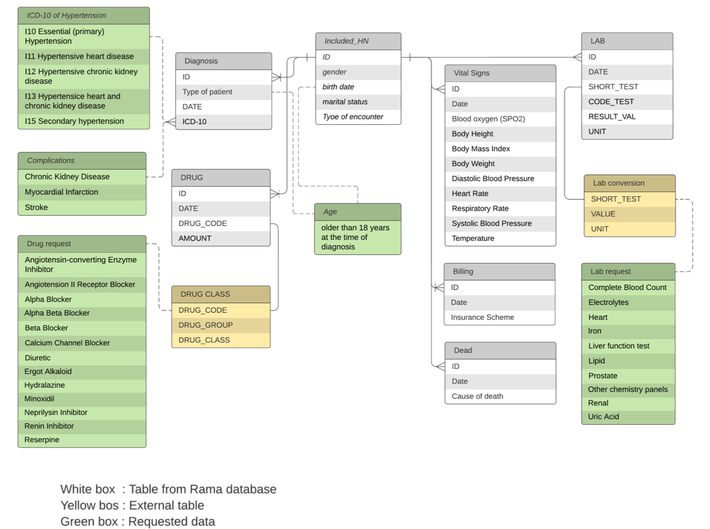
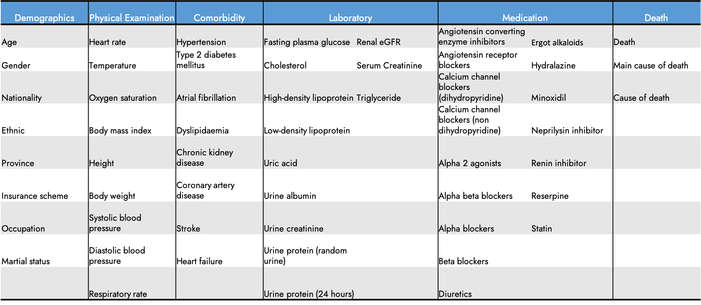
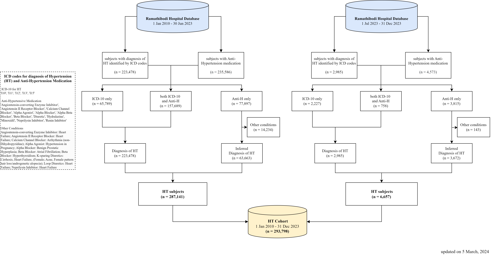
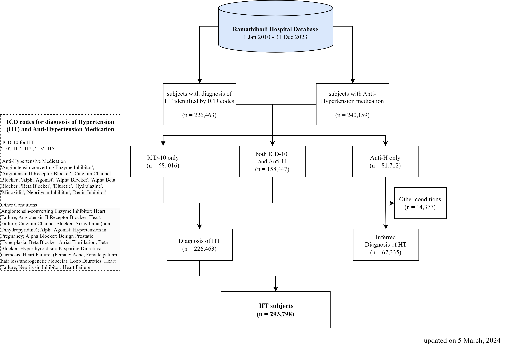

# Hypertension Data Warehouse

- **Author:** Htun Teza
- **Date:** 13 November 2023

## Contents
- [Hypertension Data Warehouse](#hypertension-data-warehouse)
  - [2010-2022 (13 years)](#2010-2022-13-years)
    - [Data Flow](#data-flow)
    - [Entity Relationship Diagram](#entity-relationship-diagram)
    - [Variables](#variables)
- [Hypertension cohort update](#hypertension-cohort-update)
  - [Data Warehouse Timeline](#data-warehouse-timeline)
    - [ETL timeline](#etl-timeline)
  - [Update Summary](#update-summary)
    - [Cohort Update](#cohort-update)
    - [Hypertension Cohort (13.5 years)](#hypertension-cohort-135-years)
- [Supplementary](#supplementary)
    - [Codes](#codes)
    - [Maplist](#codes)
    - [Data Request](#data-request) 
- [Usage](#usage)
    - [Publications](#publications)
    - [Conferences](#conferences)
    - [Competitions](#competitions)
---

## Hypertension Data Warehouse

### 2010-2022 (13 years)

Documentation on cohort identification procedure can be found [here](cohort_identification.md).

#### Data Flow

#### Entity Relationship Diagram

#### Variables

---

## Hypertension cohort update

### Data Warehouse Timeline

#### ETL timeline

With our latest data extraction (ETL) in February,

- New case update to December 2023 (Bi-Annually)
- Follow up visits update to December 2023 (Quarterly).

**Remark:** Previous ETL on 10th October 2023. Latest ETL on 15th February 2024.

### Update Summary

#### Cohort Update

#### Hypertension Cohort (14 years)

### Supplementary

#### Codes
The Python notebook for cohort identification can be found at in codes folder [here](codes/cohort_identification.ipynb).

> [!NOTE]  
> As of March 5, 2024, the data preprocessing pipeline is updated to use [Polars](https://github.com/pola-rs/polars) instead of Pandas, due to its multi-thread processing prowess. 

#### Maplist
The Map list for medications and other indications can be found at in maplist folder [here](maplist/cohort_anti_HT.xlsx).

#### Data Request
More details regarding this and other cohorts can be found [here](https://www.rama.mahidol.ac.th/ceb/CEBdatawarehouse/Data/HT) at CEB-RAMA-MU. Data request can be made on the same webpage.

### Usage

#### Publications
- Teza, H., Boonmanunt, S., Unwanatham, N., Thadanipon, K., Limpijankit, T., Pattanaprateep, O., Pattanateepapon, A., McKay, G. J., Attia, J., & Thakkinstian, A. (2023). Evaluation of transitions from early hypertension to hypertensive chronic kidney disease, coronary artery disease, stroke and mortality: a Thai real-world data cohort. *Frontiers in Cardiovascular Medicine, 10*. https://doi.org/10.3389/fcvm.2023.1170010

#### Conferences
- Teza, H., Pattanaprateep, O., Boonmanunt, S., Thadanipon, K., Limpijankit, T., Pattanateepapon, A., Unwanatham, N., & Thakkinstian, A. (2023). Hypertension and Its Associated Complications: A Thai Real-World Clinical Cohort. Poster session presented at the International Society for Pharmacoeconomics and Outcomes Research (ISPOR) 2023, Boston, MA.

#### Competitions
- Thailand Health AI Datathon 2023
