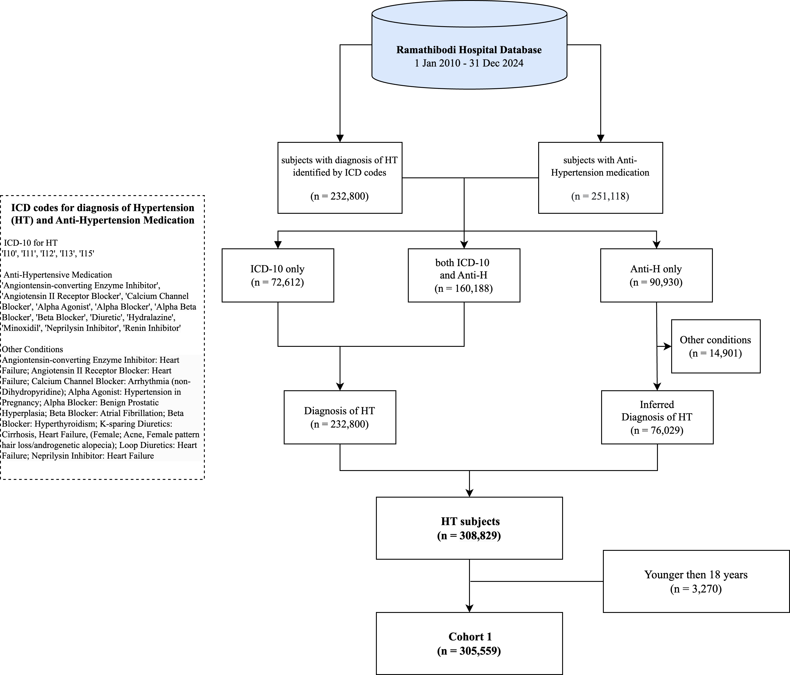
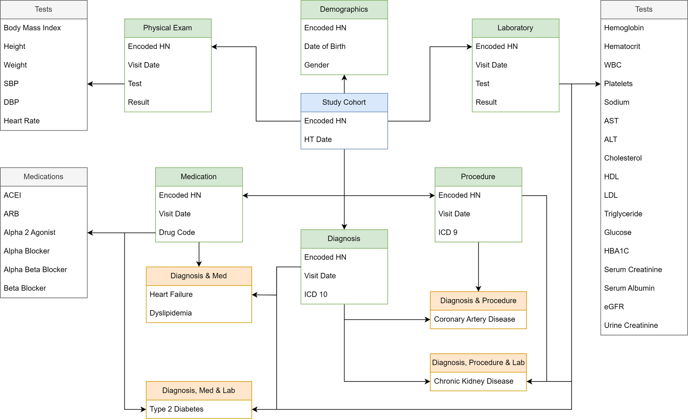
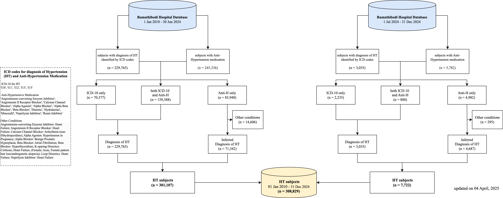
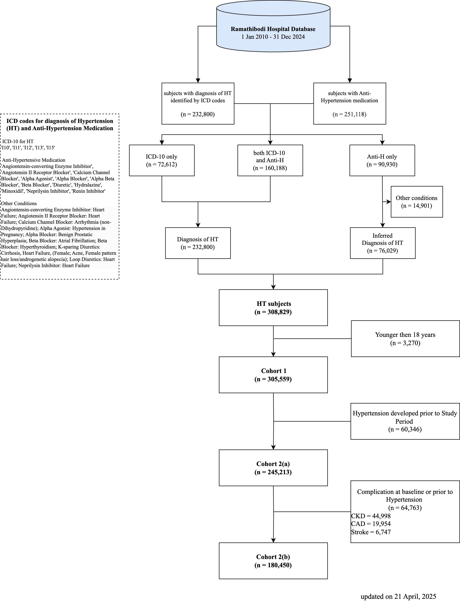

# Hypertension Data Warehouse

- **Author:** Htun Teza
- **Date:** 1 August 2025

## Contents
- [Hypertension Data Warehouse](#hypertension-data-warehouse)
  - [2010-2024/12 (15 years)](#2010-202412-15-years)
    - [Data Flow](#data-flow)
    - [Entity Relationship Diagram](#entity-relationship-diagram)
    - [Variables](#variables)
- [Hypertension cohort update](#hypertension-cohort-update)
  - [Data Warehouse Timeline](#data-warehouse-timeline)
    - [ETL timeline](#etl-timeline)
  - [Update Summary](#update-summary)
    - [Cohort Update](#cohort-update)
    - [Hypertension Cohort (15 years)](#hypertension-cohort-15-years)
- [Supplementary](#supplementary)
    - [Codes](#codes)
    - [Maplist](#codes)
    - [Data Request](#data-request) 
- [Usage](#usage)
    - [Publications](#publications)
    - [Conferences](#conferences)
    - [Competitions](#competitions)
---

## Hypertension Data Warehouse

### 2010-2024/12 (15 years)

Documentation on cohort identification procedure can be found [here](cohort_identification.md). This process has been peer-reviewed and published [here](https://doi.org/10.3389/fcvm.2023.1170010).

#### Data Flow

#### Entity Relationship Diagram

#### Variables

The complete list of variables can be found [here](https://docs.google.com/spreadsheets/u/1/d/1It8kMRhzvF-0NKo4eS0fkmqhYims3VlJ/edit?usp=sharing&ouid=109222607639327289784&rtpof=true&sd=true).

---

## Hypertension cohort update

### Data Warehouse Timeline

#### ETL timeline

With our latest data extraction (ETL) in December 2024,

- New case update to December 2024 (Bi-Annually)
- Follow up visits update to December 2024 (Quarterly).

### Update Summary

#### Cohort Update

#### Hypertension Cohort (15 years)

### Supplementary

#### Codes
The Python notebook for cohort identification can be found at in codes folder [here](codes/cohort_identification.ipynb).

> [!NOTE]  
> As of March 5, 2024, the data preprocessing pipeline is updated to use [Polars](https://github.com/pola-rs/polars) instead of Pandas, due to its multi-thread processing prowess. 

#### Maplist
The Map list for medications and other indications can be found at in maplist folder [here](maplist/cohort_anti_HT.xlsx).

#### Data Request
More details regarding this and other cohorts can be found [here](https://www.rama.mahidol.ac.th/ceb/CEBdatawarehouse/Data/HT) at CEB-RAMA-MU. Data request can be made on the same webpage.

### Usage

#### Publications
- Teza, H., Anothaisintawee, T., Limpijankit, T., Tansawet, A., Boonmanunt, S., Pattanateepapon, A., McKay, G.J., Attia, J., Thakkinstian, A. (2026) Incidence and prognosis of apparent-treatment resistant hypertension: a multi-state analysis using real world evidence. *Clinical Hypertension, 32:e5*. https://doi.org/10.5646/ch.2026.32.e5

- Limpijankit, V., Sasiprapha, T., Teza, H., Pattanateepapon, A., Siriyotha, S., Boonmanunt, S., Attia, J., & Thakkinstian, A. (2025). Factors Associated With New-Onset Atrial Fibrillation in Thai Adults with Hypertension. *American Journal of Hypertension, 38(12), 1076–1087*. https://doi.org/10.1093/ajh/hpaf149

- Wabina, R. S., Looareesuwan, P., Sonsilphong, S., Teza, H., Ponthongmak, W., McKay, G., Attia, J., Pattanateepapon, A., Panitchote, A., & Thakkinstian, A. (2025). Uncertainty-aware approach for multiple imputation using conventional and machine learning models: a real-world data study. *Journal of Big Data, 12, 95*. https://doi.org/10.1186/s40537-025-01136-3

- Teza, H., Boonmanunt, S., Unwanatham, N., Thadanipon, K., Limpijankit, T., Pattanaprateep, O., Pattanateepapon, A., McKay, G. J., Attia, J., & Thakkinstian, A. (2023). Evaluation of transitions from early hypertension to hypertensive chronic kidney disease, coronary artery disease, stroke and mortality: a Thai real-world data cohort. *Frontiers in Cardiovascular Medicine, 10*. https://doi.org/10.3389/fcvm.2023.1170010

#### Conferences
- Teza, H., Pattanaprateep, O., Boonmanunt, S., Thadanipon, K., Limpijankit, T., Pattanateepapon, A., Unwanatham, N., & Thakkinstian, A. (2023). Hypertension and Its Associated Complications: A Thai Real-World Clinical Cohort. Poster session presented at the International Society for Pharmacoeconomics and Outcomes Research (ISPOR) 2023, Boston, MA.

#### Competitions
- Thailand Health AI Datathon 2023
