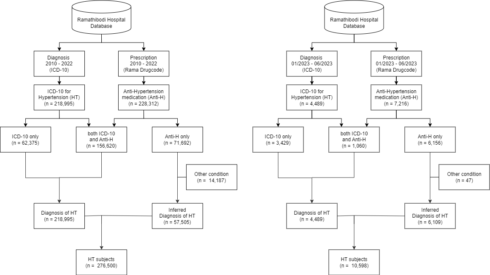
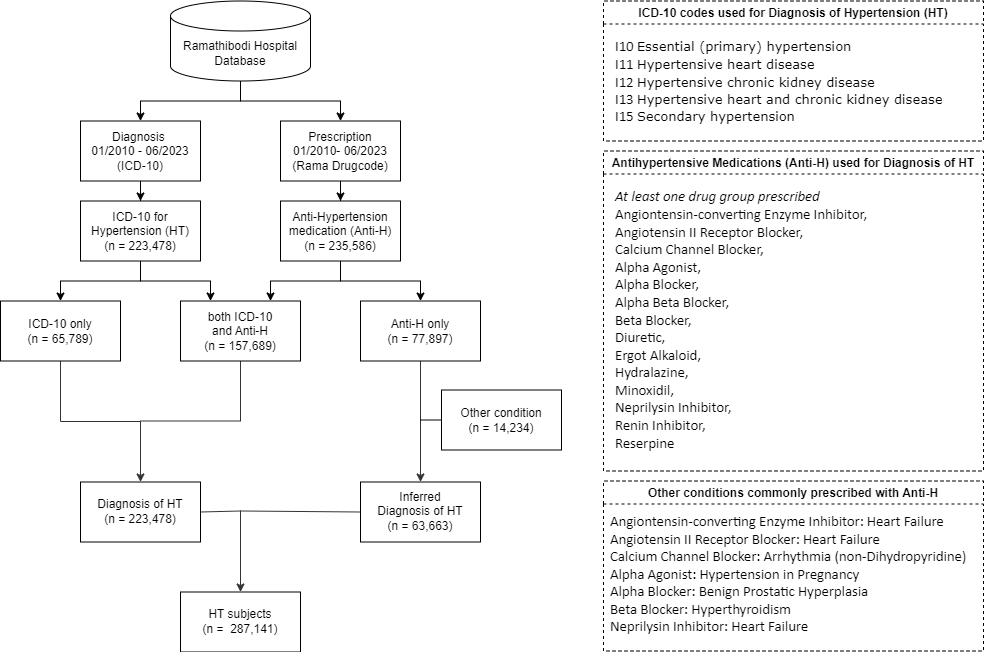

# Hypertension Data Warehouse

- **Date:** 13 November 2023

## Contents
- [Hypertension Data Warehouse](#hypertension-data-warehouse)
  - [2010-2022 (13 years)](#2010-2022-13-years)
    - [Data Flow](#data-flow)
    - [Entity Relationship Diagram](#entity-relationship-diagram)
    - [Variables](#variables)
- [Hypertension cohort update](#hypertension-cohort-update)
  - [Data Warehouse Timeline](#data-warehouse-timeline)
    - [ETL timeline](#etl-timeline)
  - [Update Summary](#update-summary)
    - [Cohort Update](#cohort-update)
    - [Hypertension Cohort (13.5 years)](#hypertension-cohort-135-years)
- [Supplementary](#supplementary)
    - [Codes](#codes)
    - [Maplist](#codes)
---

## Hypertension Data Warehouse

### 2010-2022 (13 years)

#### Data Flow

#### Entity Relationship Diagram

#### Variables

---

## Hypertension cohort update

### Data Warehouse Timeline

#### ETL timeline

With our latest data extraction (ETL) in October,

- New case update to June 2023 (Bi-Annually)
- Follow up visits update to September 2023 (Quarterly).

**Remark:** Previous ETL on 27th July 2023. Latest ETL on 10th October 2023.

### Update Summary

#### Cohort Update

#### Hypertension Cohort (13.5 years)

### Supplementary

#### Codes
The Python notebook for cohort identification can be found at in codes folder [here](code/cohort_identification.ipynb).

#### Maplist
The Map list for medications and other indications can be found at in maplist folder [here](maplist/cohort_anti_HT.xlsx).

#### Data Request
More details regarding this and other cohorts can be found [here](https://www.rama.mahidol.ac.th/ceb/CEBdatawarehouse/Data/HT) at CEB-RAMA-MU. Data request can be made on the same webpage.
